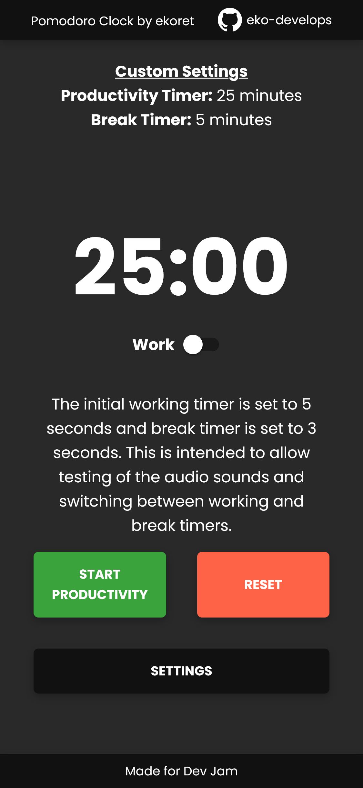

# pomodoro-clock-react

## Purpose

----------------------------------------------------------------
This project was completed as a learning experience and as a group exercise. It is created with mainly ReactJS and some components from the Material UI library. A mobile first approach was kept in mind while developing the front-end of the app.

## Example
----------------------------------------------------------------

## Features
----------------------------------------------------------------
### User Stories
1. User can see a timer for 25 minutes - the working session  

    The initial working timer is set to 5 seconds and the initial break timer is set to 3 seconds. This is to allow testing of switching between timers when they end and the audio sounds when clicking as well as the timer ending. Once the user sets custom times in the settings panel, then the timer will change accordingly.

2. After the working session is over, the User can see a timer for 5 minutes - the break session  

    The timer changes when the working session is over and does not start the break timer automatically.
3. User can start / pause, stop and reset the timers  

    The user is able to start, pause, stop, and reset the timers as they wish.

### Bonus Features
1. User can hear a sound playing when the timer hits 00:00 - denoting that the session has ended  

    An audio sound will play when clicking on elements in the UI and when the timer finishes for both working and break sessions.

2. User can change / customize the minutes in both sessions before starting

    I've added a settings panel where users can set a custom working and break timer. Upon clicking save, the timer will update to the custom timer settings.

3. User can set a long break session of 10 minutes. This will be activated every 4th break session

    DID NOT IMPLEMENT

4. Users can see active pomodoro sessions of other users  

    DID NOT IMPLEMENT

5. Users can share their pomodoro sessions with other users to do joint sessions 

    DID NOT IMPLEMENT

6. User is able to switch between working or break sessions  
    I've added my own feature where the user can switch between a working or break session.

## Dependencies
----------------------------------------------------------------
 - react 17.0.2
 - react-icons 4.3.1
 - @emotion/react 11.6.0
 - @emotion/styled 11.6.0
 - @mui/material 5.1.1

## Todo
----------------------------------------------------------------
- Add long break timer
- Refactor
- Change modal to show the react way instead of with CSS
- Update components to use module CSS